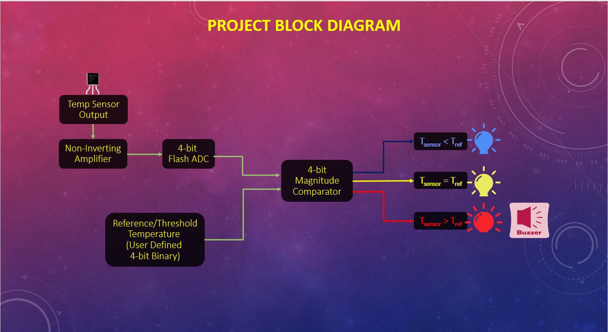
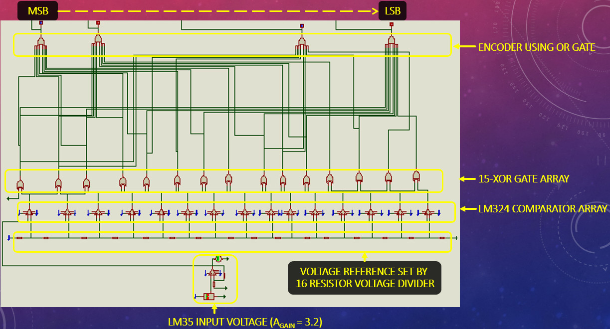
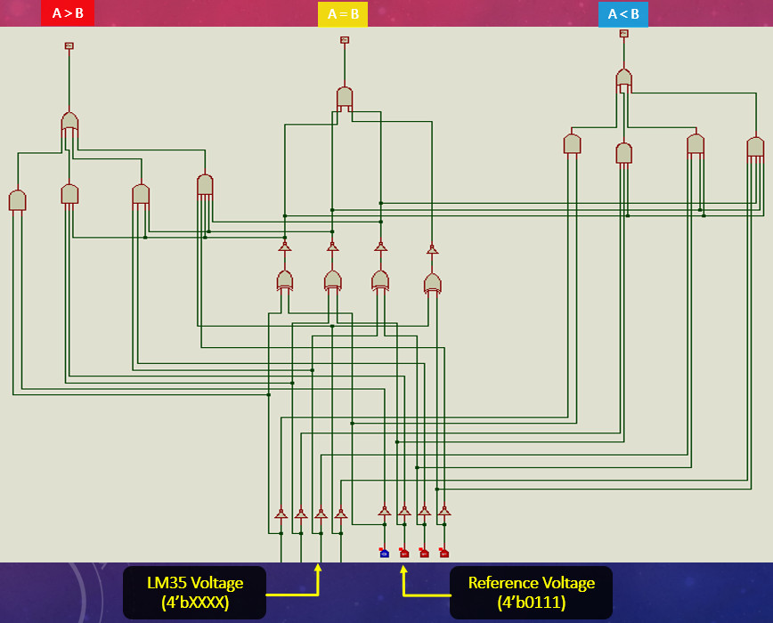
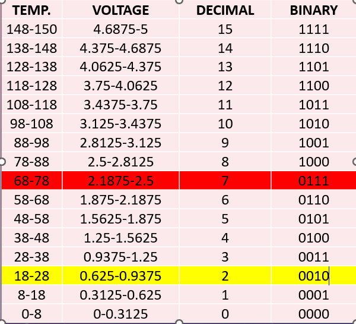

# Fire-Alarm-Circuit-Using-ADC
Fire Alarm Circuit using custom 4 bit Analog to Digital Converter

## **Components**
1. LM35   (Temp Sensor)
2. LM324 (Quad Op-Amp)
3. IC7805 (5V REGULATOR)
4. IC7404 (NOT)
5. IC7408 (AND)
6. IC7432 (OR)
7. IC7486 (XOR)
8. LED, BUZZER, POT
9. 9V Battery
10. BREADBOARD
11. JUMPER

   
## **Project Workflow**
 

   

   

## **Analog to Digital Converter**
 

   

   

## **Comparator**
 

   

   

## **Result**
 

   

   

If the temperature sensor crosses the reference temperature, the firm alarm will start to ring and warn the surrounding people.

 

## **Contributors**
1. Md. Tasnim Azad
2. Samin Zawad
3. Mahadi Hassan
4. Md. Tanveer Aziz Durbar
5. Kazi Moheuddin Alamgir
